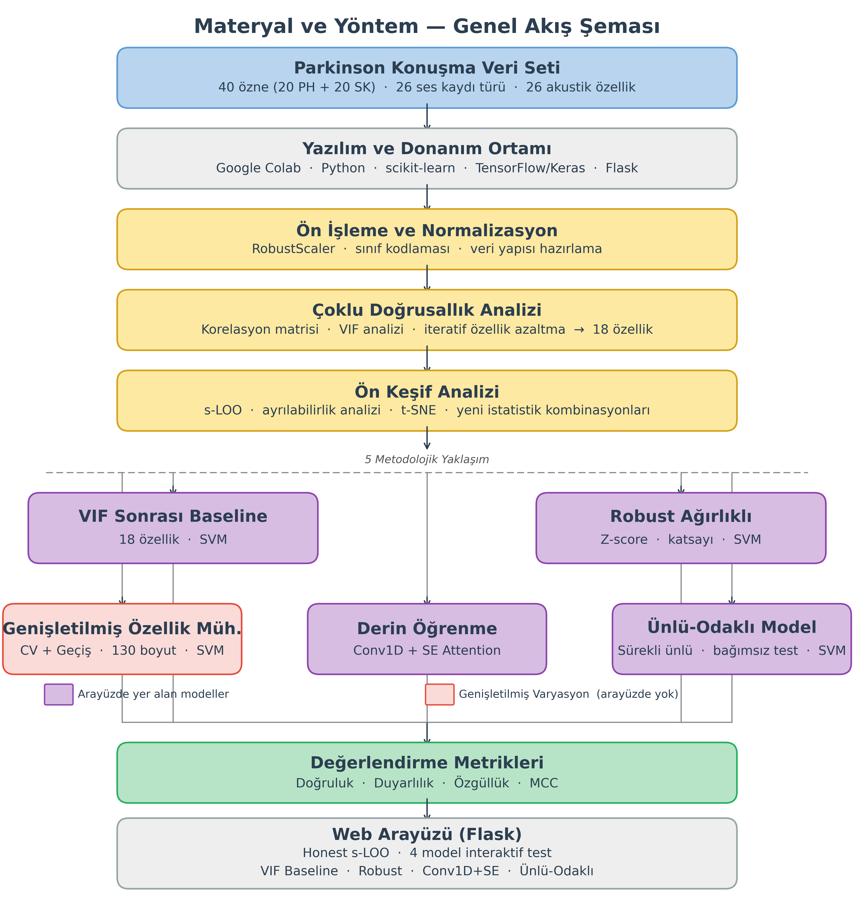
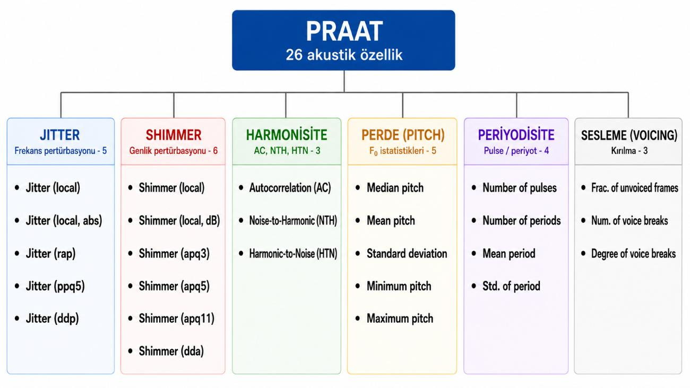
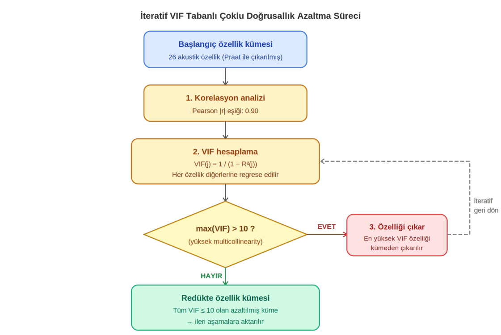
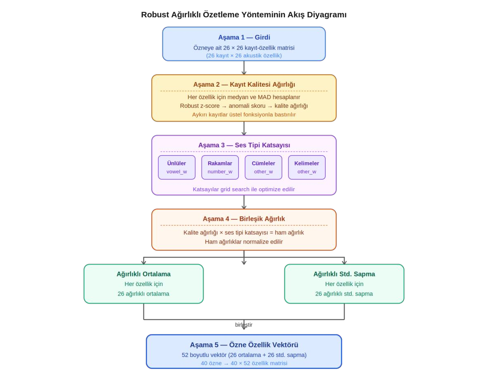
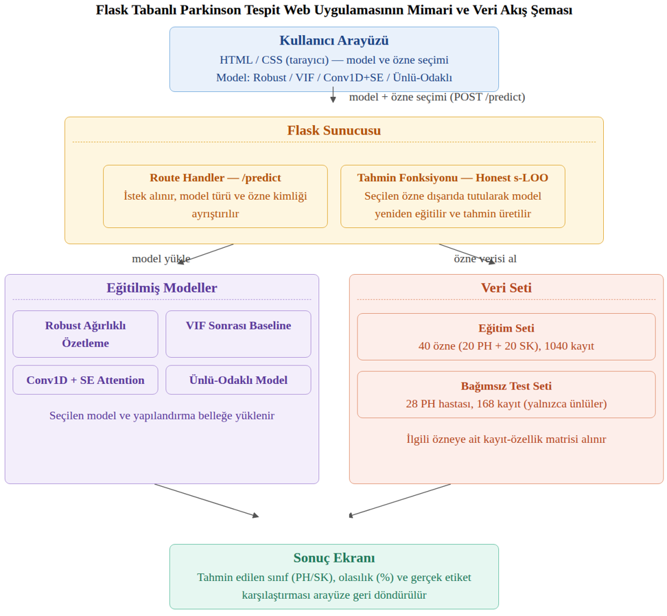
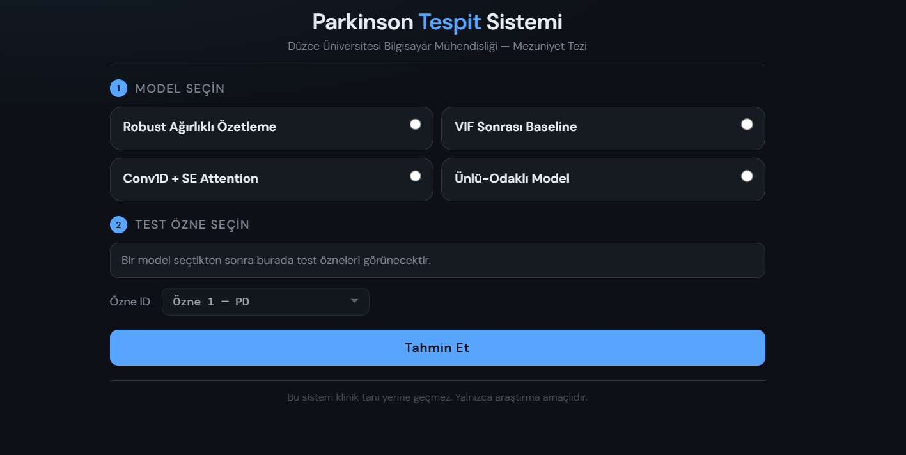
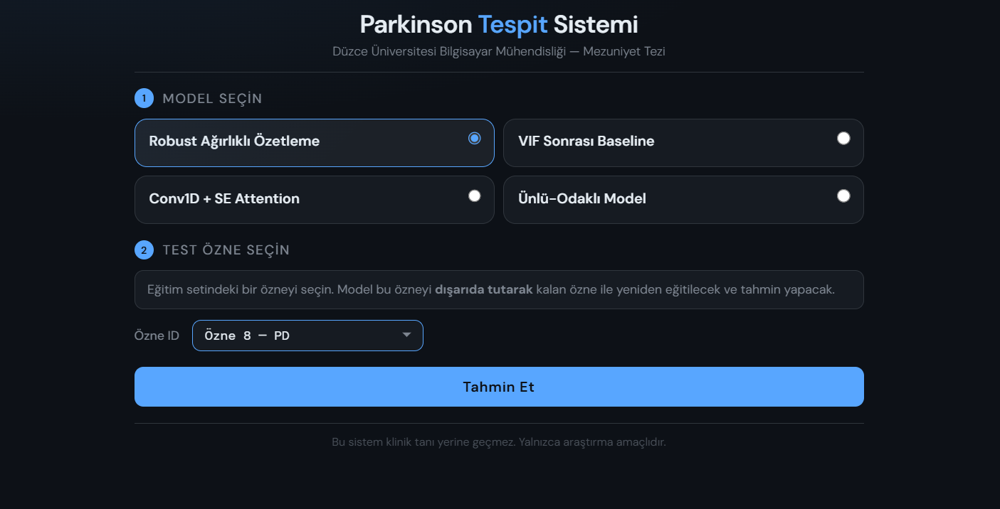
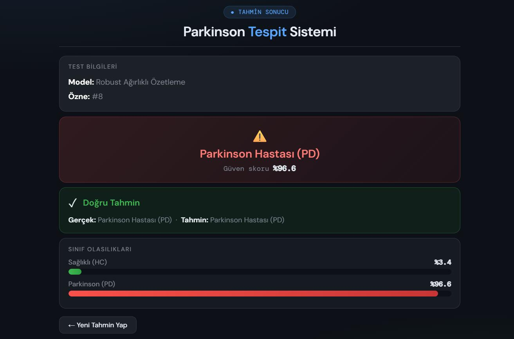
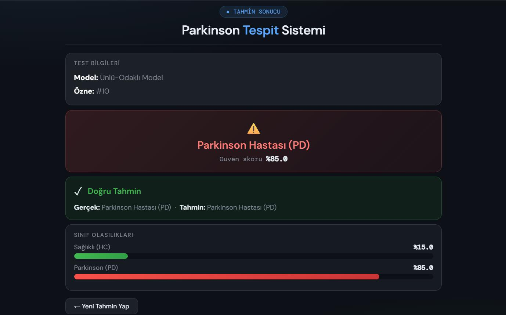

# Parkinson Hastalığının Ses Verileriyle Tespiti

**Çoklu Ses Kayıtları Üzerinde Robust Ağırlıklı Özetleme ile Parkinson Hastalığı Tespiti: Karşılaştırmalı Bir Sınıflandırma Çalışması**

Düzce Üniversitesi, Bilgisayar Mühendisliği, BM498 Mezuniyet Tezi (2025-2026)

🇹🇷 Türkçe | [🇬🇧 English](#-english)

## Öne Çıkan Sonuçlar

| Yaklaşım | Doğruluk | MCC | Duyarlılık | Özgüllük | Değerlendirme |
|---|---|---|---|---|---|
| VIF Sonrası Baseline | %82,50 | 0,6574 | %90 | %75 | s-LOO (40 özne) |
| **Robust Ağırlıklı Özetleme (önerilen)** | **%87,50** | **0,7586** | %80 | %95 | s-LOO (40 özne) |
| Tutarsızlık / Geçiş Profili (130 boyut) | %80,00 | 0,6124 | %70 | %90 | s-LOO (40 özne) |
| Conv1D + SE Attention | %85,00 | 0,7000 | %85 | %85 | s-LOO (40 özne) |
| Ünlü-Odaklı Model (/a/) | %96,43 | tanımsız | %96,43 | hesaplanamadı | Bağımsız test (28 PH) |

> **Not:** Bağımsız test setinde yalnızca Parkinson hastaları bulunduğu için özgüllük ve MCC hesaplanamamıştır. Bu sonuç, farklı bir protokolle elde edildiğinden s-LOO sonuçlarıyla doğrudan kıyaslanmamalıdır.

## Proje Hakkında

Çalışmanın amacı, farklı türlerdeki konuşma ve ses kayıtlarından çıkarılan akustik özellikleri kullanarak Parkinson hastalığını makine öğrenmesi ve derin öğrenme yöntemleriyle sınıflandırmaktır.

Çalışma üç temel soruna odaklanır:

1. **Çoklu kayıtların kişi düzeyinde temsili:** Her özneye ait 26 farklı kayıt tek bir özne vektörüne dönüştürülür. Yaygın yöntemler tüm kayıtlara eşit ağırlık verir. Burada aykırı kayıtların etkisi azaltılmıştır.
2. **Çoklu doğrusallık:** Akustik özellikler arasındaki yüksek korelasyon VIF analiziyle azaltılmıştır.
3. **Veri sızıntısını önleyen doğrulama:** Aynı kişiye ait kayıtlar hem eğitimde hem testte bulunursa sonuçlar şişer. Bu nedenle **Subject-wise Leave-One-Out (s-LOO)** kullanılmıştır. Özet çıkarma ve özellik seçimi her iterasyonda yalnızca eğitim verisiyle yeniden yapılır.

Ayrıca geliştirilen dört modeli karşılaştırmalı olarak deneyebileceğiniz bir **Flask web arayüzü** hazırlanmıştır.

### Genel Yöntem Akışı

<p align="center"></p>

## Veri Seti

[UCI Machine Learning Repository: Parkinson's Speech with Multiple Types of Sound Recordings](https://doi.org/10.24432/C5NC8M) veri seti kullanılmıştır (Sakar ve ark., 2013).

**Eğitim seti:** 20 Parkinson hastası (PH) + 20 sağlıklı kontrol (SK) = 40 özne. Her özne için 26 kayıt (3 sürekli ünlü, 10 rakam, 4 cümle, 9 kelime), toplam 1.040 kayıt. Her kayıttan jitter, shimmer, pitch, harmonisite, periyodisite ve ses kırılmaları gruplarından 26 akustik özellik çıkarılmıştır.

**Bağımsız test seti:** 28 Parkinson hastası, 168 kayıt (sürekli /a/ ve /o/ ünlüleri). Bu bireyler eğitimde kullanılmamıştır.

<p align="center"></p>

<p align="center"></p>

## Yöntem

### 1. VIF Sonrası Baseline
Pearson korelasyonunda |r| > 0,90 olan beş özellik çifti bulunmuştur. İteratif VIF (eşik: 10) ile sekiz özellik çıkarılmış, **26 özellik 18'e** düşürülmüştür. Çıkarılanlar: Shimmer_dda, Jitter_rap, Num_pulses, AC, Mean_pitch, Jitter_local, Shimmer_local, Pitch_std. Özne temsili ortalama + standart sapma ile oluşturulmuş ve RBF SVM ile sınıflandırılmıştır.

<p align="center"></p>

### 2. Robust Ağırlıklı Özetleme (önerilen yöntem)
Her özne için 26 kayıt × 26 özellik matrisi, **52 boyutlu tek bir özne vektörüne** dönüştürülür:

1. Her özellik için **medyan ve MAD** hesaplanır.
2. **Robust z-score** ile her kaydın anomali skoru bulunur.
3. Kalite ağırlığı: `w_q = exp(-skor)`. Aykırı kayıtlar üstel olarak bastırılır.
4. Kayıt tipine göre sabit **ses tipi katsayısı** uygulanır (ünlü, rakam, diğer).
5. 26 özellik için **ağırlıklı ortalama (wmean)** ve **ağırlıklı standart sapma (wstd)** hesaplanır.

En iyi katsayılarla (vowel_w = 1,2, number_w = 1,0, other_w = 0,8) RBF SVM **%87,50 doğruluk, 0,7586 MCC, %95 özgüllük** vermiştir.

<p align="center"></p>

### 3. Tutarsızlık ve Geçiş Profili
Kayıtlar arası tutarsızlığı ve ses türleri arası geçişi temsil eden ek özelliklerle 130 boyutlu bir temsil denenmiştir. 40 örnek için boyut çok yüksek olduğundan performans düşmüştür (%80,00). Bu, aşırı öğrenme riskinin iyi bir örneğidir.

### 4. Conv1D + SE Attention
Aynı 52 boyutlu özne temsili üzerinde Conv1D katmanları ve Squeeze-and-Excitation dikkat mekanizması denenmiştir (k = 12 özellik, karar eşiği 0,45). %85,00 doğruluk ile SVM'e yakın ama onun altında kalmıştır. 40 öznelik küçük veri setinde derin öğrenme klasik yöntemlere üstünlük sağlayamamıştır.

### 5. Ünlü-Odaklı Bağımsız Test Modeli
Bağımsız test setindeki /a/ ve /o/ kayıtlarına uygun olarak yalnızca ünlü kayıtlarıyla çalışan bir model kurulmuştur. Eğitim setinde tek ünlü (/a/ veya /o/) kullanan konfigürasyonlar s-LOO'da en yüksek sonucu vermiştir. Seçilen final model (yalnızca /a/, k = 20, C = 1, γ = 0,001) tüm 40 özne ile eğitilmiş ve 28 hastanın **27'sini doğru** sınıflandırmıştır (%96,43).

## Bulgular

- **Önerilen yöntem baseline'ı geçti:** %82,50 → %87,50 doğruluk, 0,6574 → 0,7586 MCC.
- **En kararlı özellikler** ses kırılması ve sesleme ile ilgili olanlardır: `Degree_voice_breaks`, `Num_voice_breaks`, `Frac_unvoiced_frames`, ayrıca `Shimmer_apq11`. Bu özellikler 40 katın tamamında veya neredeyse tamamında seçilmiştir.
- **Değişkenlik bilgisi işe yarıyor:** `wstd` özellikleri seçimlerin %56,4'ünü oluşturmuştur.
- **Ses türü etkisi farklıdır:** K-means / ARI analizinde tek bir kayıt türü kendi başına belirgin bir sınıf ayrımı vermemiştir. Sürekli ünlüler, bağımsız testte ve tek ünlülü s-LOO deneylerinde güçlü sonuç vermiştir.
- **Derin öğrenme küçük veride avantaj sağlamadı.**

### Karşılaştırma
Aynı veri setinde Sakar ve ark. %77,50 (s-LOO) bildirmiştir. Bu çalışmadaki %87,50 aynı bağlamda değerlendirilebilir.

## Sınırlılıklar

- Eğitim seti yalnızca 40 özne içerir, aşırı öğrenme riski yüksektir.
- Veri tek merkezden ve tek dilden (Türkçe) toplanmıştır.
- Bağımsız test setinde sağlıklı kontrol yoktur, özgüllük ve MCC hesaplanamamıştır.
- Tek ünlü modelinin eğitim setindeki %100 sonucu, model/hiperparametre seçimi aynı s-LOO üzerinde yapıldığı için iyimser olabilir. Bağımsız test bu yüzden önemlidir.

## Web Uygulaması

Flask tabanlı arayüzde dört model (Robust Ağırlıklı Özetleme, VIF Baseline, Conv1D + SE Attention, Ünlü-Odaklı) seçilip bir özne üzerinde denenebilir. Her tahminde **Honest s-LOO** uygulanır: seçilen özne modelden dışarıda tutulur ve model yeniden eğitilir. Böylece eğitim verisine bakarak çıkan sahte yüksek doğruluk önlenir. Arayüzde tahmin, güven skoru, HC/PD olasılıkları ve gerçek sınıf karşılaştırması görülür.

<p align="center"></p>

<p align="center">
  
  
</p>
<p align="center">
  
  
</p>

## Notebooklar

```
notebooks/
├── 01_Iki_Yeni_Metrik_Ekleme.ipynb
├── 02_Iteratif_VIF_Analizi.ipynb
├── 03_ARI_t_SNE_analizler.ipynb
├── 04_VIF_Sonrasi_Baseline_Model.ipynb
├── 05_Robust_Agirlikli_Ozetleme_Model.ipynb
├── 06_Conv1D_SE_Attention_Model.ipynb
├── 07_Tutarsizlik_Gecis_Profili.ipynb
└── 08_Unlu_Odakli_Bagimsiz_Test_Model.ipynb
```

Deneyler Google Colab üzerinde, `random_state = 42` ile yapılmıştır.

## Kullanılan Teknolojiler

Python, NumPy, Pandas, SciPy, statsmodels, scikit-learn, TensorFlow/Keras, Matplotlib, Seaborn, Joblib, Flask, HTML/CSS.

## Proje Yapısı

```
parkinson-detection/
├── docs/                  # README ve tez görselleri (PNG)
├── model/                 # Eğitilmiş modeller ve yardımcı dosyalar (.pkl)
├── notebooks/             # Deneysel çalışmalar
├── static/
│   └── style.css
├── templates/
│   ├── index.html
│   └── result.html
├── utils/
│   ├── __init__.py
│   └── predictors.py
├── app.py
├── requirements.txt
├── .gitignore
└── README.md
```

## Kurulum ve Çalıştırma

```bash
git clone https://github.com/siladrtl/parkinson-detection.git
cd parkinson-detection
python -m venv venv
venv\Scripts\activate        # Windows
# source venv/bin/activate   # macOS / Linux
pip install -r requirements.txt
python app.py
```

Uygulama `http://localhost:5000` adresinde açılır.

## Veri Seti Atfı

Kursun, O., Sakar, B., Isenkul, M., Sakar, C., Sertbas, A., & Gurgen, F. (2013). *Parkinson's Speech with Multiple Types of Sound Recordings*. UCI Machine Learning Repository. DOI: [10.24432/C5NC8M](https://doi.org/10.24432/C5NC8M). Lisans: CC BY 4.0.

Bu repodaki model ve işlenmiş veri dosyaları, bu veri setiyle yapılan akademik çalışmanın çıktılarıdır.

## Uyarı

Bu proje yalnızca akademik araştırma ve eğitim amacıyla geliştirilmiştir. Üretilen sonuçlar tıbbi tanı değildir ve profesyonel sağlık hizmetinin yerine kullanılmamalıdır.

---

# 🇬🇧 English

## Parkinson's Disease Detection from Voice Recordings

**Robust Weighted Summarization of Multiple Voice Recording Types: A Comparative Classification Study**

Undergraduate thesis (BM498), Department of Computer Engineering, Düzce University, 2025-2026.

## Key Results

| Approach | Accuracy | MCC | Sensitivity | Specificity | Evaluation |
|---|---|---|---|---|---|
| VIF-Based Baseline | 82.50% | 0.6574 | 90% | 75% | s-LOO (40 subjects) |
| **Robust Weighted Summarization (proposed)** | **87.50%** | **0.7586** | 80% | 95% | s-LOO (40 subjects) |
| Inconsistency / Transition Profile (130 dims) | 80.00% | 0.6124 | 70% | 90% | s-LOO (40 subjects) |
| Conv1D + SE Attention | 85.00% | 0.7000 | 85% | 85% | s-LOO (40 subjects) |
| Vowel-Focused Model (/a/) | 96.43% | undefined | 96.43% | not computable | Independent test (28 PD) |

> **Note:** The independent test set contains only Parkinson's patients, so specificity and MCC cannot be computed. Because it uses a different protocol, this result is not directly comparable to the s-LOO results.

## About the Project

The goal is to classify Parkinson's disease from acoustic features extracted from multiple types of speech recordings. The study addresses three problems:

1. **Subject-level representation of multiple recordings.** Each subject has 26 recordings, summarized into one vector. Common approaches weight all recordings equally. Here, anomalous recordings are down-weighted.
2. **Multicollinearity** among acoustic features, reduced with iterative VIF analysis.
3. **Leakage-free validation.** If one person's recordings appear in both training and test data, results are inflated. Therefore **Subject-wise Leave-One-Out (s-LOO)** is used, and summarization and feature selection are redone inside every fold using training data only.

A **Flask web app** lets you compare the four models interactively.

## Dataset

[UCI: Parkinson's Speech with Multiple Types of Sound Recordings](https://doi.org/10.24432/C5NC8M) (Sakar et al., 2013).

**Training set:** 20 PD patients + 20 healthy controls (HC) = 40 subjects, 26 recordings each (3 sustained vowels, 10 numbers, 4 sentences, 9 words), 1,040 recordings in total, with 26 acoustic features (jitter, shimmer, pitch, harmonicity, pulse/period, voice breaks).

**Independent test set:** 28 PD patients, 168 recordings (sustained /a/ and /o/), unseen during training.

## Methodology

1. **VIF-based baseline.** Five feature pairs had |r| > 0.90. Iterative VIF (threshold 10) removed 8 features, reducing **26 to 18**. Subject vectors use mean + std, classified with an RBF SVM.
2. **Robust Weighted Summarization (proposed).** A 26 × 26 recording-by-feature matrix becomes a **52-dim subject vector**: (a) median and MAD per feature, (b) robust z-score anomaly score per recording, (c) quality weight `exp(-score)`, (d) a fixed voice-type coefficient (vowel / number / other), (e) weighted mean (wmean) and weighted std (wstd) per feature. Best coefficients: vowel_w = 1.2, number_w = 1.0, other_w = 0.8.
3. **Inconsistency and transition profile.** A 130-dim extended representation. With only 40 subjects the dimensionality was too high and performance dropped (overfitting).
4. **Conv1D + SE Attention** on the same 52-dim representation (k = 12, threshold 0.45). Close to, but below, the SVM.
5. **Vowel-focused independent test model.** Best configuration (only /a/, k = 20, C = 1, γ = 0.001) trained on all 40 subjects, correctly classified **27 of 28** unseen patients.

## Findings

- Robust summarization beat the baseline: 82.50% → 87.50% accuracy, MCC 0.6574 → 0.7586.
- The most stable features relate to voice breaks and unvoiced frames (`Degree_voice_breaks`, `Num_voice_breaks`, `Frac_unvoiced_frames`), plus `Shimmer_apq11`.
- Variability (wstd) features made up 56.4% of selections.
- No single recording type separated the classes well in K-means / ARI analysis, while sustained vowels were strong in the single-vowel experiments and the independent test.
- Deep learning gave no advantage on such a small dataset.
- For reference, Sakar et al. reported 77.50% (s-LOO) on the same dataset.

## Limitations

- Only 40 training subjects, so overfitting risk is high.
- Data come from a single center and a single language (Turkish).
- No healthy controls in the independent test set, so specificity and MCC are not available.
- The 100% single-vowel result on the training set may be optimistic since model selection used the same s-LOO. That is why the independent test matters.

## Web Application

Select one of four models and a subject, then view the prediction, confidence, HC/PD probabilities and the true class. Every prediction uses **Honest s-LOO**: the selected subject is excluded and the model is retrained, avoiding inflated accuracy from seeing the subject during training.

## Installation

```bash
git clone https://github.com/siladrtl/parkinson-detection.git
cd parkinson-detection
python -m venv venv
venv\Scripts\activate        # Windows
# source venv/bin/activate   # macOS / Linux
pip install -r requirements.txt
python app.py
```

Open `http://localhost:5000`.

## Dataset Citation

Kursun, O., Sakar, B., Isenkul, M., Sakar, C., Sertbas, A., & Gurgen, F. (2013). *Parkinson's Speech with Multiple Types of Sound Recordings*. UCI Machine Learning Repository. DOI: [10.24432/C5NC8M](https://doi.org/10.24432/C5NC8M). License: CC BY 4.0.

## Disclaimer

This project is for academic research and education only. Its outputs are not a medical diagnosis and must not replace professional medical evaluation.
